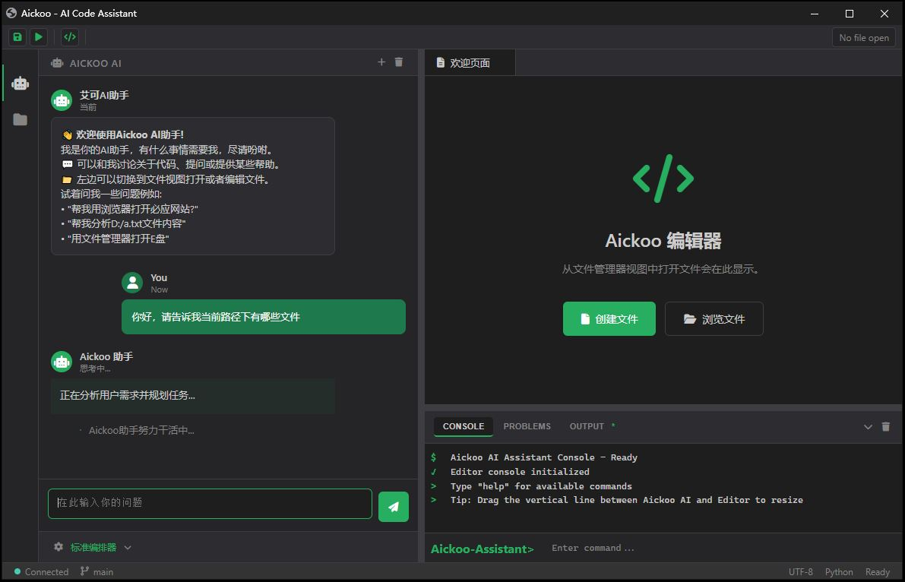

# Aickoo AI Assistant 特点介绍

## 产品概述

艾可助手（Aickoo AI Assistant）是一款基于 Python 的本地 AI 助手，采用 Eel 框架提供现代化的 Web 界面（类似 VSCode/Cursor 风格）。它集成了大语言模型（LLM）、工具系统、Agent 编排器和 MCP 协议，可在本地终端浏览器中完成编码、文档处理、图像生成、浏览器自动化等任务。

在 Windows 上通过 AI 自动处理用户提出的办公、编程、电商、设计、操作软件等相关任务。提供 AI 执行过程查看，可使用 Skills 扩展能力，还提供 MCP 连接 API 扩展 AI 能力。

---



## 核心功能

### 🏢 Windows 办公环境支持

- **浏览器操作**：支持 CDP 浏览器自动化操作，实现网页数据采集、表单填写、页面交互等功能
- **Excel 读取**：无缝读取和处理 Excel 文件，支持数据提取、格式转换、报表生成
- **文件操作**：支持读写文件、PowerShell 命令执行等本地操作
- **办公自动化**：集成多种办公场景工具，提升日常工作效率

### 💬 大语言模型支持

- **DeepSeek**：原生支持 DeepSeek 模型，提供高质量的对话体验
- **本地部署**：支持连接本地部署的 DeepSeek 模型和 Ollama，数据安全可控
- **云端模型**：支持云端模型（DeepSeek、Volcengine 等）
- **模型扩展**：预留模型扩展接口，支持未来接入更多大语言模型

### 🎨 用户友好界面

- **Windows 专属设计**：针对 Windows 系统优化的界面风格，操作习惯符合 Windows 用户体验
- **VSCode 风格布局**：三栏布局（文件浏览器/编辑器 + 会话/AI 聊天），未来会设计成可自由拓展的架构
- **直观的操作界面**：简洁明了的 UI 设计，降低学习成本
- **流畅的交互体验**：响应迅速，操作便捷

### 🎯 Agent 定制能力

- **多 Agent 协同**：操作系统助手、LLM 直答、图像设计、浏览器、文档处理
- **自由配置 Agent**：用户可以简单配置自己的专属 Agent
- **定制 Tool**：根据需求定制工具，扩展 AI 能力边界
- **定制 Skill**：定义技能组合，实现特定场景的自动化流程（目前适配了编程、初步游戏开发等技能）
- **集成 MCP**：支持连接 Model Context Protocol 服务，扩展外部工具调用能力

### 🔄 任务编排器

- **自动任务拆解**：智能将复杂任务拆解为有序子任务
- **流程可视化**：提供 AI 执行过程查看，清晰了解任务执行路径
- **高效协作**：多 Agent 协同完成复杂任务

---

## 独立特点

### 🌱 对小白用户友好

- **零门槛上手**：简单直观的操作界面，无需编程知识
- **轻量级实现**：纯 Python + HTML 实现，减小用户使用门槛
- **预设场景模板**：提供常见办公场景的预设配置，一键启用
- **详细使用指南**：配套完整的用户手册，快速掌握使用方法

### 💼 对商业使用友好

- **个人使用免费**：个人用户完全免费使用，无功能限制
- **企业级稳定性**：商业环境下的无忧运行
- **数据安全保障**：支持本地模型部署，数据不经过第三方服务器
- **SQLite 持久化**：会话持久化与历史记录，数据安全可靠

### 🔧 完全自由定制

- **打造专属 AI**：用户可以将其完全定制成自己的专属 AI 助手
- **灵活配置**：支持针对 Agent 定制选择 Tool、Skill 和 MCP
- **个性化流程**：根据业务需求，构建个性化的 AI 工作流程
- **可拓展架构**：未来会设计成可自由拓展的架构

### ⚡ AI 决策效率优化

- **提升 AI 智商**：通过精心设计的决策机制，提升 AI 的问题解决能力
- **减少 Token 使用**：优化指令传递和响应生成，降低模型调用成本
- **精准行为控制**：用户可以精准控制 AI 的行为路径，确保执行结果符合预期
- **高效任务编排**：任务编排器自动优化任务执行顺序，提升整体效率

---

## 适用场景

| 场景类型 | 具体应用 |
|---------|---------|
| **日常办公** | Excel 数据处理、文档生成、信息整理 |
| **数据采集** | 网页数据抓取、市场调研、竞品分析 |
| **编程开发** | 代码编写、调试、初步游戏开发 |
| **自动化流程** | 重复性任务自动化、报表生成、邮件处理 |
| **智能问答** | 知识查询、技术咨询、方案建议 |
| **图像设计** | 图像生成、设计辅助 |
| **个性化助手** | 根据业务需求定制专属 AI 助手 |

---

## 技术优势

1. **轻量级架构**：资源占用低，运行流畅
2. **模块化设计**：功能模块解耦，便于扩展和维护
3. **协议标准化**：支持 MCP 协议，便于集成第三方工具
4. **本地优先**：支持本地模型部署，保护数据隐私
5. **Eel 框架**：现代化 Web 界面，开发效率高

---

## 总结

艾可助手（Aickoo AI Assistant）是一款功能强大、易于使用、高度可定制的 Windows AI 助手。无论是小白用户还是商业用户，都能通过简单的配置，打造属于自己的智能办公助手，提升工作效率，降低运营成本。

**让 AI 成为您最得力的办公伙伴！**

---

*本软件为纯 Python + HTML 实现，减小用户使用门槛。*


# Aickoo AI Assistant 快速使用指南

## 目录

1. [运行环境要求](#1-运行环境要求)
2. [启动方式](#2-启动方式)
3. [通过 Chrome 访问](#3-通过-chrome-访问)
4. [项目文件夹结构说明](#4-项目文件夹结构说明)
5. [配置说明](#5-配置说明)
6. [常见问题](#6-常见问题)

---

## 1. 运行环境要求

| 项目 | 要求 |
|------|------|
| 操作系统 | Windows 10 / Windows 11 |
| 内存 | 建议 8GB 及以上 |
| 磁盘空间 | 至少 500MB（含内置 Chrome 和 Python） |
| 网络 | 需要访问 LLM API（本地模型或云服务） |

---

## 2. 启动方式

### 方式一：双击启动（推荐）

直接双击项目根目录下的 `start.bat` 文件：

```
Aickoo-Assistant/
└── start.bat    ← 双击此文件启动
```

### 方式二：命令行启动

打开命令提示符（CMD）或 PowerShell，进入项目根目录，执行：

```cmd
cd d:\workspace_python\Aickoo-Assistant
start.bat
```

或直接执行：

```cmd
python310\python.exe tst.py run
```

### 启动后

- 程序会自动启动一个命令行窗口
- 随后会自动打开 Chrome 浏览器，加载 AI 助手界面
- 默认访问地址：`http://localhost:<端口>/index.html`（端口由程序自动分配）

---

## 3. 通过 Chrome 访问

如果需要使用浏览器自动化功能（如网页操作、数据采集等），需要先启动 Chrome 调试模式：

### 步骤 1：启动 Chrome 调试模式

双击 `start-chrome.bat` 文件：

```
Aickoo-Assistant/
└── start-chrome.bat    ← 双击此文件启动 Chrome 调试模式
```

或在命令行执行：

```cmd
start-chrome.bat
```

这会启动一个带有调试端口的 Chrome 实例（端口号：9222）。

### 步骤 2：启动程序

启动 Chrome 调试模式后，再按第 2 节的方式启动主程序：

```cmd
start.bat
```

### 注意事项

- **必须先启动 `start-chrome.bat`，再启动 `start.bat`**
- Chrome 调试窗口会打开一个空白页面，**请勿关闭此窗口**
- 程序会自动连接到 Chrome 调试端口，实现浏览器自动化操作

---

## 4. 项目文件夹结构说明

```
Aickoo-Assistant/
├── aickoo/                    # 源码文件夹
│   ├── __init__.py
│   ├── __main__.py
│   ├── cmd/                   # 命令行入口
│   ├── internal/              # 核心模块
│   │   ├── app/               # 应用逻辑
│   │   ├── config/            # 配置管理
│   │   ├── db/                # 数据库操作
│   │   ├── eel_ui.py          # Web 界面
│   │   ├── mcp/               # MCP 协议实现
│   │   └── splash_screen.py   # 启动画面
│   └── logging.py             # 日志管理
├── chrome-win64/              # 内置 Chrome 浏览器
│   └── chrome.exe             # Chrome 可执行文件
├── python310/                 # 内置 Python 运行环境
│   ├── python.exe             # Python 解释器
│   ├── Scripts/               # pip 等脚本
│   └── Lib/                   # Python 标准库和第三方库
├── mcp/                       # MCP 插件配置目录
│   └── bing-sse/              # Bing 搜索 MCP 示例
│       └── mcp.json           # MCP 服务配置文件
├── skills/                    # Skill 技能目录
│   ├── algorithmic-art/       # 算法艺术技能
│   ├── download-command/      # 下载命令技能
│   └── skill-creator/         # Skill 创建工具
├── plugins/                   # 插件目录（定制 Agent 和 Tool）
│   └── demo/                  # 示例插件
│       ├── plugin.py          # 插件定义
│       └── tools.py           # 工具实现
├── web/                       # Web 前端资源
│   ├── index.html             # 主页面
│   └── assets/                # 静态资源（图片、CSS、JS）
├── aickoo.json                # 主配置文件
├── start.bat                  # 程序启动脚本
├── start-chrome.bat           # Chrome 调试模式启动脚本
└── tst.py                     # 测试入口文件
```

### 各文件夹详细说明

| 文件夹 | 作用 |
|--------|------|
| `aickoo/` | 存放项目源码，包含核心模块、命令行入口、Web 界面等 |
| `chrome-win64/` | 存放内置的 Chrome 浏览器，供 Eel 框架调用 |
| `python310/` | 存放内置的 Python 运行环境，包含解释器和依赖库 |
| `mcp/` | 用于定制 MCP 连接信息或存放 MCP 相关程序 |
| `skills/` | 用于定制 Skill（技能），扩展 AI 能力 |
| `plugins/` | 用于定制 Agent（智能体）和 Tool（工具） |
| `web/` | 存放 Web 前端资源（HTML、CSS、JS） |

---

## 5. 配置说明

### 主配置文件

项目根目录下的 `aickoo.json` 是主配置文件：

```json
{
  "ai": {
    "deepseek-llm": {
      "base_url": "https://api.deepseek.com",
      "api_key": "sk-你的API密钥",
      "model": "deepseek-reasoner"
    }
  },
  "agents": {
    "os": {
      "model": "deepseek",
      "tools": ["read", "write", "powershell", "mcp"],
      "skills": [],
      "mcp": ["bing-sse"]
    }
  },
  "params": {
    "path_workspace": "D:/workspace_temp",
    "path_skills": "D:/workspace_python/Aickoo-Assistant/skills"
  }
}
```

### 配置项说明

| 配置项 | 说明 |
|--------|------|
| `ai.<模型名>.api_key` | 你的 API 密钥，需要在对应平台申请 |
| `ai.<模型名>.base_url` | API 服务地址 |
| `agents.<Agent名>.tools` | 该 Agent 启用的工具列表 |
| `agents.<Agent名>.skills` | 该 Agent 启用的技能列表 |
| `agents.<Agent名>.mcp` | 该 Agent 启用的 MCP 服务列表 |

---

## 6. 常见问题

### Q: 程序启动后浏览器没有自动打开？

A: 请手动打开 Chrome，查看命令行窗口输出，找到类似 `http://localhost:<端口>` 的地址进行访问（端口由程序自动分配）。

### Q: Chrome 调试模式启动失败？

A: 请检查 `chrome-win64/chrome.exe` 是否存在，或使用系统已安装的 Chrome。

### Q: AI 没有响应？

A: 请检查 `aickoo.json` 中的 API 密钥是否正确，网络是否能访问 API 地址。

### Q: 如何关闭程序？

A: 关闭浏览器窗口即可，后端进程会自动退出。也可以在命令行窗口按 `Ctrl+C` 强制终止。

### Q: 如何查看日志？

A: 日志文件为 `app.log`，可使用文本编辑器打开查看。

---

## 附录：快捷键

| 快捷键 | 功能 |
|--------|------|
| `Ctrl+Enter` | 发送消息 |
| `Ctrl+S` | 保存当前文件 |

---


# Aickoo AI Assistant 定制手册

## 目录

1. [aickoo.json 配置文件定制](#1-aickoojson-配置文件定制)
   - 1.1 配置 LLM 访问
   - 1.2 定制 Agents
   - 1.3 为 Agent 配置 Tools、Skills、MCP
2. [plugins/ 文件夹定制](#2-plugins-文件夹定制)
   - 2.1 定制 Tools
   - 2.2 定制 Agents
   - 2.3 插件开发样例
3. [skills/ 文件夹定制](#3-skills-文件夹定制)
   - 3.1 Skill 结构说明
   - 3.2 Skill 开发样例
4. [mcp/ 文件夹定制](#4-mcp-文件夹定制)
   - 4.1 MCP 配置说明
   - 4.2 MCP 开发样例

---

## 1. aickoo.json 配置文件定制

### 1.1 配置 LLM 访问

在 `aickoo.json` 的 `ai` 字段中配置大语言模型：

```json
{
  "ai": {
    "deepseek-llm": {
      "base_url": "https://api.deepseek.com",
      "api_key": "sk-your-api-key",
      "model": "deepseek-reasoner"
    },
    "deepseek-llm-local": {
      "base_url": "http://localhost:11434/v1",
      "api_key": "dummy",
      "model": "your-local-model-name"
    },
    "volcengine-generate_image": {
      "base_url": "https://ark.cn-beijing.volces.com/api/v3",
      "api_key": "your-volcengine-api-key",
      "model": "doubao-seedream-5-0-260128"
    }
  }
}
```

**配置项说明：**

| 配置项 | 说明 |
|--------|------|
| `base_url` | API 服务地址 |
| `api_key` | API 密钥（本地模型可填 `dummy`） |
| `model` | 模型名称 |

**支持的模型类型：**
- DeepSeek 云端模型
- 本地 Ollama 模型（base_url: `http://localhost:11434/v1`）
- 火山引擎图片生成模型

### 1.2 定制 Agents

在 `aickoo.json` 的 `agents` 字段中定义 Agent：

```json
{
  "agents": {
    "my_custom_agent": {
      "model": "deepseek",
      "maxTokens": 8000,
      "role": "primary",
      "description": "自定义 Agent 的描述",
      "prompt": "Agent 的系统提示词",
      "prompt_extra_env": false,
      "prompt_extra_lsp": true,
      "tools": ["read", "write", "glob", "powershell"],
      "skills": [],
      "mcp": []
    }
  }
}
```

**配置项说明：**

| 配置项 | 说明 |
|--------|------|
| `model` | 使用的模型名称（对应 `ai` 字段中的键名） |
| `maxTokens` | 最大 Token 数限制 |
| `role` | Agent 角色类型（`primary` 为主 Agent） |
| `description` | Agent 的功能描述，用于选择器 |
| `prompt` | Agent 的系统提示词 |
| `prompt_extra_env` | 是否启用环境提示增强 |
| `prompt_extra_lsp` | 是否启用 LSP 代码提示增强 |
| `tools` | 启用的工具列表 |
| `skills` | 启用的技能列表 |
| `mcp` | 启用的 MCP 服务列表 |

### 1.3 为 Agent 配置 Tools、Skills、MCP

#### 配置 Tools

```json
{
  "agents": {
    "os": {
      "tools": ["read", "write", "glob", "powershell"]
    }
  }
}
```

**内置工具列表：**

| 工具名称 | 功能 |
|----------|------|
| `read` | 读取文件内容 |
| `write` | 写入文件内容 |
| `glob` | 文件匹配搜索 |
| `powershell` | 执行 PowerShell 命令 |
| `cdp` | Chrome DevTools Protocol 浏览器操作 |
| `excel` | Excel 文件操作 |
| `image_qa` | 图片问答 |
| `generate_image` | 图片生成 |

#### 配置 Skills

```json
{
  "agents": {
    "os": {
      "skills": ["download-command", "algorithmic-art"]
    }
  }
}
```

#### 配置 MCP

```json
{
  "agents": {
    "bing": {
      "mcp": ["bing-sse"]
    }
  }
}
```

---

## 2. plugins/ 文件夹定制

### 2.1 插件结构

插件目录结构：

```
plugins/
└── your_plugin_name/
    ├── __init__.py
    ├── plugin.py       # 插件定义
    └── tools.py        # 工具实现
```

### 2.2 定制 Tools

#### 步骤 1：创建工具实现文件 `tools.py`

```python
from aickoo.internal.app.tools import BaseToolKit, Tool, ToolType

def custom_tool_function(param1: str, param2: int) -> str:
    """自定义工具函数的文档字符串"""
    return f"处理完成: {param1}, {param2}"

class CustomToolKit(BaseToolKit):
    """自定义工具包"""
    
    def __init__(self):
        super().__init__("custom_toolkit_name")
    
    def get_tools(self):
        return [
            Tool(
                name="custom_tool_function",
                description="自定义工具的描述",
                function=custom_tool_function,
                parameters={
                    "param1": {"type": "string", "description": "参数1说明"},
                    "param2": {"type": "integer", "description": "参数2说明"}
                },
                type=ToolType.FUNCTION
            )
        ]
```

#### 步骤 2：创建插件定义文件 `plugin.py`

```python
from typing import List, Dict
from aickoo.internal.app.tools import BaseToolKit
from aickoo.internal.app.base import BasePlugin
from .tools import CustomToolKit

class Plugin(BasePlugin):
    """自定义插件实现"""
    
    @staticmethod
    def get_tool_kits() -> List[BaseToolKit]:
        """获取插件提供的所有工具包"""
        return [
            CustomToolKit()
        ]
    
    @staticmethod
    def get_agent_dict() -> Dict:
        """获取插件提供的所有 Agent"""
        return {}
```

#### 步骤 3：创建 `__init__.py`

```python
from .plugin import Plugin
```

### 2.3 定制 Agents

在插件的 `plugin.py` 中定义 Agent：

```python
from typing import List, Dict
from aickoo.internal.app.tools import BaseToolKit
from aickoo.internal.app.base import BasePlugin
from .tools import CustomToolKit

class Plugin(BasePlugin):
    """自定义插件实现"""
    
    @staticmethod
    def get_tool_kits() -> List[BaseToolKit]:
        return [CustomToolKit()]
    
    @staticmethod
    def get_agent_dict() -> Dict:
        """获取插件提供的所有 Agent"""
        return {
            "my_plugin_agent": {
                "model": "deepseek",
                "maxTokens": 8000,
                "role": "primary",
                "description": "插件提供的自定义 Agent",
                "prompt": "你是一个专业的助手，擅长处理自定义任务。",
                "tools": ["custom_tool_function"],
                "skills": [],
                "mcp": []
            }
        }
```

### 2.4 插件开发样例

完整示例：创建一个计算器插件

```python
# plugins/calculator/tools.py
from aickoo.internal.app.tools import BaseToolKit, Tool, ToolType

def add(a: int, b: int) -> int:
    """计算两个数的和"""
    return a + b

def subtract(a: int, b: int) -> int:
    """计算两个数的差"""
    return a - b

class CalculatorToolKit(BaseToolKit):
    """计算器工具包"""
    
    def __init__(self):
        super().__init__("calculator")
    
    def get_tools(self):
        return [
            Tool(
                name="add",
                description="计算两个数的和",
                function=add,
                parameters={
                    "a": {"type": "integer", "description": "第一个数"},
                    "b": {"type": "integer", "description": "第二个数"}
                },
                type=ToolType.FUNCTION
            ),
            Tool(
                name="subtract",
                description="计算两个数的差",
                function=subtract,
                parameters={
                    "a": {"type": "integer", "description": "被减数"},
                    "b": {"type": "integer", "description": "减数"}
                },
                type=ToolType.FUNCTION
            )
        ]
```

```python
# plugins/calculator/plugin.py
from typing import List, Dict
from aickoo.internal.app.tools import BaseToolKit
from aickoo.internal.app.base import BasePlugin
from .tools import CalculatorToolKit

class Plugin(BasePlugin):
    """计算器插件"""
    
    @staticmethod
    def get_tool_kits() -> List[BaseToolKit]:
        return [CalculatorToolKit()]
    
    @staticmethod
    def get_agent_dict() -> Dict:
        return {}
```

```python
# plugins/calculator/__init__.py
from .plugin import Plugin
```

---

## 3. skills/ 文件夹定制

### 3.1 Skill 结构

Skill 目录结构：

```
skills/
└── your_skill_name/
    ├── SKILL.md        # Skill 定义文件
    ├── LICENSE.txt     # 许可证文件（可选）
    └── scripts/        # 脚本目录（可选）
        └── your_script.py
```

### 3.2 SKILL.md 格式

```markdown
---
name: skill_name
description: Skill 的简短描述
triggers:
  keywords:
    - keyword1
    - keyword2
  patterns:
    - "pattern.*regex"
tools:
  - bash
  - grep
priority: high
mcp: []
---

# Skill 名称

详细描述该 Skill 的功能和用途。

## Capabilities

- Capability 1
- Capability 2

## Best Practices

1. Practice 1
2. Practice 2

## Examples

示例说明。
```

**Frontmatter 字段说明：**

| 字段 | 说明 |
|------|------|
| `name` | Skill 名称（必须） |
| `description` | Skill 的简短描述（必须） |
| `triggers.keywords` | 触发关键词列表 |
| `triggers.patterns` | 触发正则表达式列表 |
| `tools` | 该 Skill 需要的工具列表 |
| `priority` | 优先级：`high`、`medium`、`low` |
| `mcp` | 该 Skill 需要的 MCP 服务列表 |

### 3.3 Skill 开发样例

完整示例：创建一个 "文件备份" Skill

```markdown
---
name: file-backup
description: 备份指定文件到指定目录，自动生成带时间戳的备份文件名
triggers:
  keywords:
    - backup
    - 备份
    - save
  patterns:
    - "backup.*file"
    - "save.*copy"
tools:
  - powershell
  - write
priority: medium
mcp: []
---

# 文件备份 Skill

该 Skill 用于将指定文件备份到指定目录，并自动生成带时间戳的备份文件名。

## Capabilities

- 根据用户提供的源文件路径和目标目录，执行文件复制操作
- 自动在文件名中添加时间戳，避免覆盖旧备份
- 支持创建不存在的目标目录

## Best Practices

1. 备份前确认源文件存在
2. 使用绝对路径指定源文件和目标目录
3. 定期清理过期的备份文件

## Implementation

使用 Python 脚本实现文件复制功能，自动在文件名中添加时间戳。

### Script: `scripts/backup_file.py`

```python
#!/usr/bin/env python3
"""
备份文件到指定目录，自动添加时间戳。
Usage: python backup_file.py <源文件路径> <目标目录路径>
"""

import sys
import os
import shutil
from datetime import datetime

def backup_file(source_path: str, target_dir: str) -> str:
    """
    备份文件到目标目录
    """
    if not os.path.exists(source_path):
        return f"错误：源文件不存在: {source_path}"
    
    if not os.path.exists(target_dir):
        os.makedirs(target_dir)
    
    filename = os.path.basename(source_path)
    name, ext = os.path.splitext(filename)
    timestamp = datetime.now().strftime("%Y%m%d_%H%M%S")
    backup_filename = f"{name}_{timestamp}{ext}"
    target_path = os.path.join(target_dir, backup_filename)
    
    shutil.copy2(source_path, target_path)
    return f"备份成功: {target_path}"

def main():
    if len(sys.argv) != 3:
        print("Usage: python backup_file.py <源文件路径> <目标目录路径>")
        sys.exit(1)
    
    source_path = sys.argv[1]
    target_dir = sys.argv[2]
    result = backup_file(source_path, target_dir)
    print(result)

if __name__ == "__main__":
    main()
```

## Examples

输入: `backup D:\workspace\project\config.py to D:\backup`

输出: `备份成功: D:\backup\config_20260715_103000.py`
```

---

## 4. mcp/ 文件夹定制

### 4.1 MCP 结构

MCP 目录结构：

```
mcp/
└── your_mcp_name/
    └── mcp.json        # MCP 配置文件
```

### 4.2 MCP 配置格式

目前经过测试的只有方式二，其他方式还在开发中。

#### 方式一：本地命令行模式（stdio）

```json
{
    "name": "local_mcp_service",
    "description": "本地 MCP 服务",
    "transport": "stdio",
    "command": "python -m your_mcp_server",
    "config": {
        "timeout": 30,
        "max_retries": 3
    }
}
```

#### 方式二：SSE 流式模式

```json
{
    "name": "bing-sse",
    "description": "Bing 搜索 SSE 服务",
    "transport": "sse",
    "url": "https://mcp.api-inference.modelscope.net/xxx/sse",
    "headers": {
        "Authorization": "Bearer your-token",
        "Content-Type": "application/json",
        "Accept": "application/json, text/event-stream"
    }
}
```

#### 方式三：HTTP 流式模式

```json
{
    "name": "streamable_http_service",
    "description": "HTTP 流式 MCP 服务",
    "transport": "streamable-http",
    "url": "https://api.example.com/mcp",
    "send_url": "https://api.example.com/mcp/send",
    "stream_url": "https://api.example.com/mcp/stream",
    "config": {
        "timeout": 60,
        "max_retries": 3
    }
}
```

### 4.3 MCP 开发样例

#### 创建一个本地 MCP Server

**步骤 1：创建服务器代码**

```python
# mcp/my_mcp_service/my_mcp_server.py
from mcp.server.fastmcp import FastMCP
from pydantic import BaseModel, Field
from typing import Optional

mcp = FastMCP("my_mcp_service")

class WeatherQuery(BaseModel):
    city: str = Field(..., description="城市名称", min_length=1)
    units: Optional[str] = Field(default="celsius", description="温度单位")

@mcp.tool(
    name="get_weather",
    annotations={
        "title": "获取天气信息",
        "readOnlyHint": True
    }
)
async def get_weather(params: WeatherQuery) -> str:
    """获取指定城市的天气信息"""
    return f"{params.city} 的天气：晴朗，温度 25°C"

if __name__ == "__main__":
    mcp.run()
```

**步骤 2：创建 mcp.json 配置**

```json
{
    "name": "my_mcp_service",
    "description": "天气查询 MCP 服务",
    "transport": "stdio",
    "command": "python -m my_mcp_server",
    "config": {
        "timeout": 30,
        "max_retries": 3
    }
}
```

**步骤 3：在 aickoo.json 中启用**

```json
{
  "agents": {
    "weather_agent": {
      "model": "deepseek",
      "role": "primary",
      "description": "天气查询助手",
      "prompt": "你是一个天气查询助手，使用天气工具回答用户的问题。",
      "tools": [],
      "skills": [],
      "mcp": ["my_mcp_service"]
    }
  }
}
```

---

## 附录：完整配置示例

```json
{
  "plugin": ["calculator"],
  "ai": {
    "deepseek-llm": {
      "base_url": "https://api.deepseek.com",
      "api_key": "sk-your-api-key",
      "model": "deepseek-reasoner"
    }
  },
  "agents": {
    "custom_agent": {
      "model": "deepseek",
      "maxTokens": 8000,
      "role": "primary",
      "description": "自定义全能助手",
      "prompt": "你是一个全能助手，可以处理文件操作、计算和天气查询。",
      "tools": ["read", "write", "add", "subtract"],
      "skills": ["file-backup", "download-command"],
      "mcp": ["my_mcp_service", "bing-sse"]
    }
  },
  "params": {
    "path_workspace": "D:/workspace_temp",
    "path_skills": "D:/workspace_python/Aickoo-Assistant/skills"
  }
}
```

